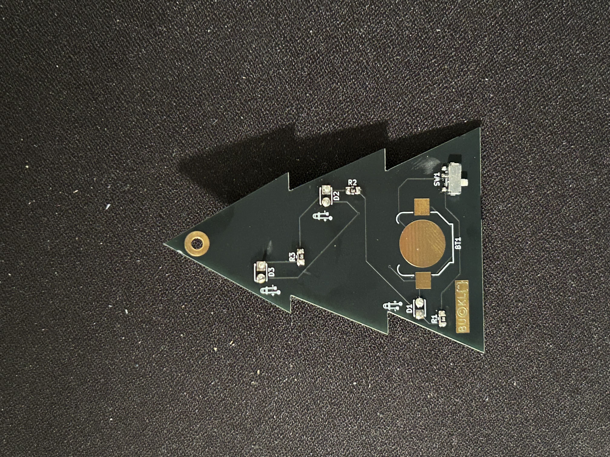

# Christmas Tree 2024

The below image demonstrates the correct orientation and placement of the diodes and resistors.
Follow the diagram on the back of the pcb. With the shorter leg (cathode) going into the square hole from the front of the pcb and the long leg (anode) going into the round hole.
After the led is soldered in place you can safely snip the legs.

I unfortunately ordered the wrong resistance resistors. These 68 Ohm resistors are slightly too resistive and the LEDs at the top show a little dull.
If you would like them a little more brilliant you can either replace the resisistors with 62 Ohm resistors or bypass one or both of the resistors by soldering a wire directly to the first trace.

The on position of the switch is in the position marked on the board. Make sure to solder the switch with the three legs fitting into the solder pads.

Alternatively you can just enjoy the ornament for what it is without any leds.

Merry Christmas!
